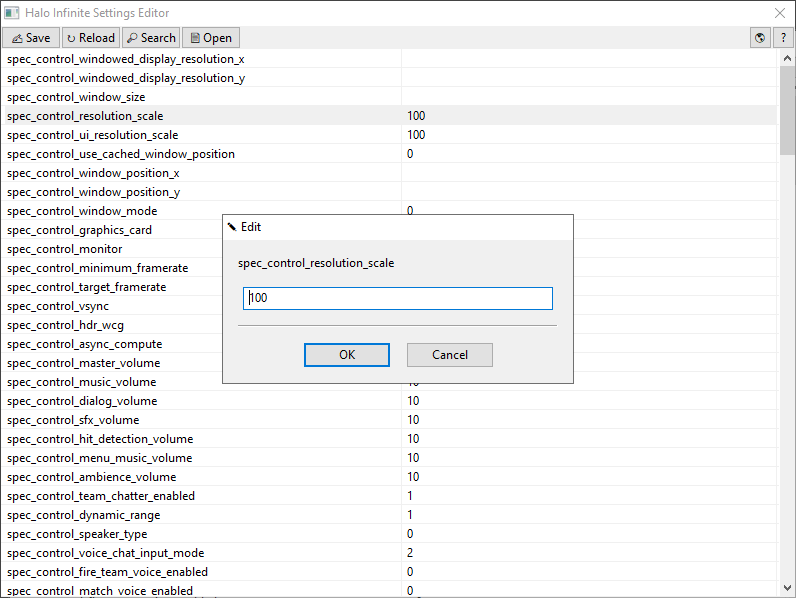

# Halo Infinite Settings Editor
 A tool to edit & view Halo Infinite's settings file (SpecControlSettings.json).

# How to use?
1. Fetch the latest release from [GitHub Releases](https://github.com/Aetopia/Halo-Infinite-Settings-Editor/releases).
2. Start `Halo Infinite Settings Editor.exe`.
3. The program will automatically detect where the `SpecControlSettings.json` file is and then load its contents.
4. Here is how the interface looks like:
    

5. The toolbar has the following operations:
    1. `[Save]`: Save the current settings.
    2. `[Reload]`: Reload settings from `SpecControlSettings.json`.
    3. `[Open]`: Open `SpecControlSettings.json` in a text editor.

6. To edit a value, double click value you want to edit to open up the `Edit Dialog Box`.
    
    You can enter the following data types:
    1. `String`
    2. `Integer`
    3. `Null`: To put in a `Null` value, simply leave the leave the textbox empty and hit `[Ok]`.

# Build
1. Install Nim. 
    > Use `ChooseNim` to install Nim: https://github.com/dom96/choosenim              
    Download the latest release: https://nim-lang.org/install.html      

2. Install Dependencies:

    ```
    nimble install wNim
    ```

3. Build:
    - `Halo Infinite Settings Editor.exe`
        ```
        nim c -o:"Halo Infinite Settings Editor.exe" --app:gui -d:release -d:strip --opt:size src/main.nim
        ```
    - **Optional:** Compress using UPX!
        ```
        upx -9 "Halo Infinite Settings Editor.exe"
        ```