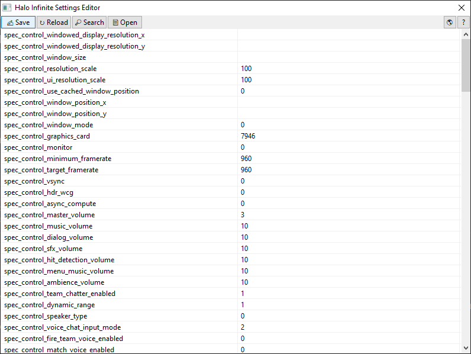

# Halo Infinite Settings Editor
 A tool to edit & view Halo Infinite's settings file (SpecControlSettings.json).

# How to use?
1. Fetch the latest release from [GitHub Releases](https://github.com/Aetopia/Halo-Infinite-Settings-Editor/releases).
2. Start `Halo Infinite Settings Editor.exe`.
3. The program will automatically detect where the `SpecControlSettings.json` file is and then load its contents.
4. Here is how the interface looks like:

    

5. The toolbar has the following operations:
    | Button | Operation |
    |--------|------------|
    | `✍️` | Save the current settings.|
    | `↻` | Reload settings from `SpecControlSettings.json`. |
    | `🔎` | Search for a key.|
    | `📄` | Open the `SpecControlSettings.json` file in a text editor. |
    | `?` | Information on Halo Infinite Settings Editor. |

6. Operations:
    - To edit a value, double click value you want to edit to open up the `Edit Dialog Box`.

        
        You can enter the following data types:
        | Value | How to enter? |
        |-|-|
        |String|Enter a alphanumeric expression.|
        |Integer|Enter a numeric expression.|
        |Null|Enter a blank value.|
    
    - To search for a key, click on `[🔎]` and enter your query.

        

# Build
1. Install Nim. 
    > Use `ChooseNim` to install Nim: https://github.com/dom96/choosenim              
    Download the latest release: https://nim-lang.org/install.html      

2. Install Dependencies:

    ```
    nimble install wNim
    ```

3. Build:
    - `Halo Infinite Settings Editor.exe`
        ```
        nim c -o:"Halo Infinite Settings Editor.exe" --app:gui -d:release -d:strip --opt:size src/main.nim
        ```
    - **Optional:** Compress using UPX!
        ```
        upx -9 "Halo Infinite Settings Editor.exe"
        ```